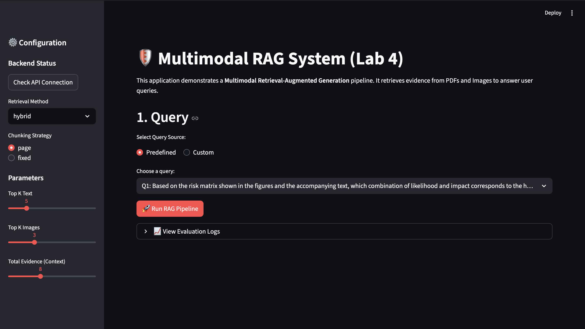
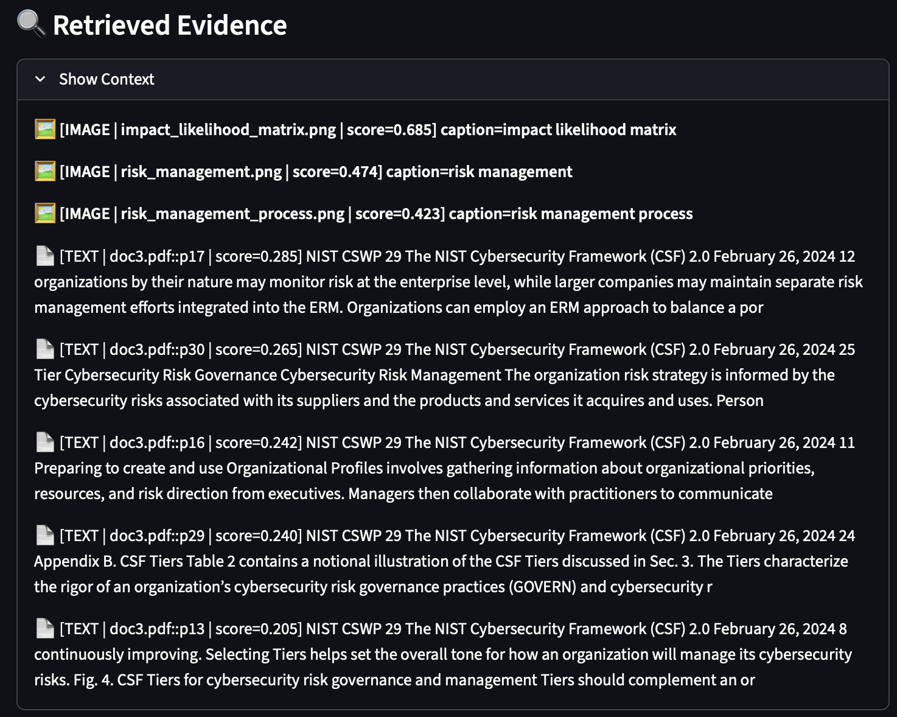
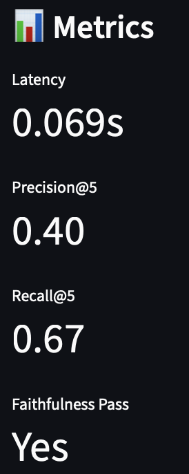

# Lab 4: Multimodal RAG Application

This is a deployable Multimodal RAG application built with Streamlit and a FastAPI backend. It uses PyMuPDF for PDF extraction, SentenceTransformers for embeddings, and TF-IDF/BM25 for sparse retrieval.

---

## 1. Public Deployment Link

**Deployed application:**  
- `https://your-repo-name.streamlit.app`

---

## 2. How to Run Locally

1. **Install dependencies:**
   ```bash
   pip install -r requirements.txt
   ```

2. **Start the FastAPI backend** (Terminal 1):
   ```bash
   uvicorn api.server:app --reload --port 8000
   ```

3. **Start the Streamlit UI** (Terminal 2):
   ```bash
   streamlit run app/main.py
   ```

4. Open the UI at `http://localhost:8501`. Ensure the API is running at `http://127.0.0.1:8000` (use "Check API Connection" in the sidebar).

**Data:** Place your PDFs in `data/docs/` and images in `data/images/`.

---

## 3. Screenshots

### UI


### Evidence Panel


### Metrics Panel


---

## 4. Results Snapshot: 5 Queries × 2 Retrieval Modes

| Query ID | Question (summary)           | Hybrid P@5 / R@10 | Sparse P@5 / R@10 |
|----------|------------------------------|----------------------------------|----------------------------------------|
| Q1       | Risk matrix, likelihood/impact | 0.40 / 0.67                          | 0.40 / 0.67                                  |
| Q2       | Zero Trust principle         | 0.40 / 1.00                            | 0.60 / 1.50                                  |
| Q3       | Encryption algorithm (AES/RSA) | 0.20 / 1.00                          | 0.00 / 0.00                                 |
| Q4       | Zero Trust components (diagram) | 0.20 / 1.00                         | 0.20 / 1.00                                  |
| Q5       | Budget allocation (missing evidence) | No gold evidence defined (Missing Evidence Test)                    | No gold evidence defined (Missing Evidence Test)                                  |


---

## 5. Failure Analysis (2 Cases)

### 5.1 Retrieval Failure
**Query:** "What specific encryption algorithm is mandated by the organization's policy?"

**Issue:** The system retrieved generic "security policy" documents but missed the specific page (e.g. Page 33 of `doc5.pdf`) that explicitly mentions "AES-256".

**Root cause:**
- Page-based chunking included too much irrelevant text, diluting the TF-IDF score for the exact sentence.
- The dense retriever treated "security standard" and "encryption algorithm" as similar, so high-level summaries ranked above the specific requirement.

**Proposed fix:**
- Use smaller fixed-size chunks to isolate the sentence containing "AES-256".
- Use the Cross-Encoder reranker for better question–passage alignment.

---

### 5.2 Grounding / Missing-Evidence Failure
**Query:** "What is the specific budget allocation for the cybersecurity initiative?"

**Issue:** The system correctly returned "Not enough evidence in the retrieved context." A user might expect an answer if they assume a financial table in an image (e.g. `impact_likelihood_matrix.png`) contains budget data.

**Root cause:**
- The app uses image filenames/captions only; there is no OCR or vision model to read text inside figures.
- The caption "Impact Likelihood Matrix" does not match "budget", so the image was not retrieved for this query.

**Proposed fix:**
- Add OCR or a vision-language model to index text inside images.
- Improve image captions (e.g. clarify that the table is risk-related, not financial).

---

## Project Structure

- `app/main.py` — Streamlit UI (required).
- `rag/pipeline.py` — Retrieval, indexing, and answer generation.
- `api/server.py` — FastAPI backend.
- `data/docs/` — PDFs; `data/images/` — images.
- `logs/` — `query_metrics.csv` (auto-created).
- `requirements.txt` — Python dependencies.

## Evaluation & Logs

- Metrics are appended to `logs/query_metrics.csv` (timestamp, query_id, method, latency, Precision@5, Recall@10, faithfulness, evidence_ids).
- Use the predefined queries (Q1–Q5) in the UI to evaluate against gold evidence IDs.
